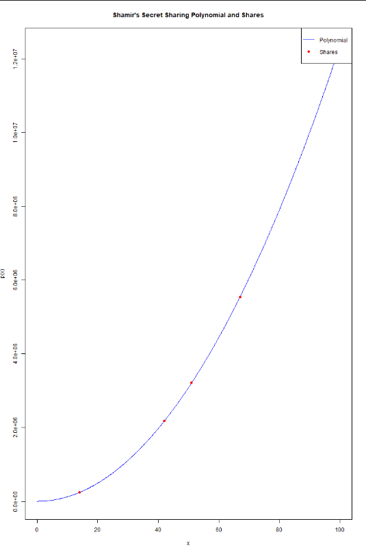
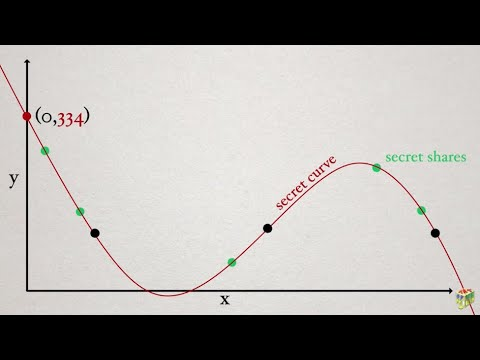

# Secret Sharing: Explanation and Resources

This repository provides an implementation of **Shamir's Secret Sharing** using **Newton's Divided Differences** method in R. It includes a detailed explanation of the algorithm, the R program, and additional resources for learning.

---

## Table of Contents
1. [Shamir's Secret Sharing?](#what-is-secret-sharing)
2. [How It Works](#how-it-works)
3. [R Program](#r-program)
4. [Graphical Representation](#graphical-representation)
5. [Resources](#resources)
6. [Video Explanation](#video-explanation)

---

## What is Shamir's Secret Sharing?

Shamir's Secret Sharing is a cryptographic algorithm that allows a secret to be divided into multiple **shares**. The secret can only be reconstructed when a minimum number of shares (called the **threshold**) are combined. This ensures that:
- The secret is secure even if some shares are lost or compromised.
- Only authorized groups of users (with enough shares) can reconstruct the secret.

---

## How It Works

1. **Polynomial Generation**:
   - A polynomial of degree \( t-1 \) is created, where \( t \) is the threshold.
   - The constant term of the polynomial is the secret \( s \).
   - Example: \( p(x) = s + a_1 x + a_2 x^2 + \dots + a_{t-1} x^{t-1} \).

2. **Share Generation**:
   - Each share is a point \( (x_i, p(x_i)) \) on the polynomial.
   - The shares are distributed to the participants.

3. **Secret Reconstruction**:
   - Any \( t \) shares can be used to reconstruct the polynomial using **Lagrange Interpolation** or **Newton's Divided Differences**.
   - The secret is obtained by evaluating the polynomial at \( x = 0 \).

---

## R Program

The R program in this repository implements Shamir's Secret Sharing with the following features:
- Generates a **large prime number** (more than 5 digits) for the finite field.
- Allows the user to input the secret, number of parties, and threshold.
- Generates shares and reconstructs the secret using **Newton's Divided Differences**.
- Plots the polynomial and marks the shares on the graph.

### How to Run the Program
1. Install R and the `numbers` package:
   ```R
   install.packages("numbers")

### graphical-representation


### video-explanation
link : https://youtu.be/iFY5SyY3IMQ?si=Si8yz_5YX1kzEN20

